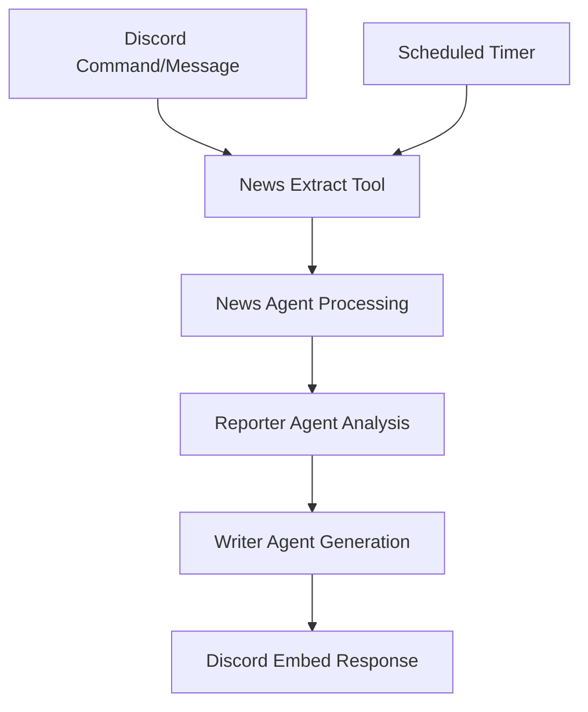

# 🤖 Mastra AI Discord News Bot

[](https://opensource.org/licenses/ISC)
[](https://nodejs.org/)
[](https://www.typescriptlang.org/)

A Discord bot powered by Mastra AI that fetches and delivers the latest technology news through intelligent agents. The bot responds to commands and messages, providing summarized tech news updates on demand and through automated scheduled posts.

## ✨ Features

- **🤖 Discord Integration**: Fully functional Discord bot with slash commands and message responses
- **🔍 Intelligent News Extraction**: Fetches latest technology news from multiple sources using NewsAPI
- **🤖 Multi-Agent Architecture**: Coordination between specialized news, reporter, and writer agents
- **📰 Automated News Delivery**: Scheduled news updates every 6 hours on specified Discord channels
- **🎯 Topic-Specific Search**: Search for news on specific technology topics (AI, blockchain, cybersecurity, etc.)
- **📊 Content Summarization**: AI-powered summarization of news articles for concise delivery

## 🏗️ Project Architecture

```
news-mastra/
├── src/
│   └── mastra/
│       ├── agents/
│       │   ├── news-agent.ts      # News article processing & coordination
│       │   ├── reporter-agent.ts  # Data analysis & report generation
│       │   └── writer-agent.ts    # Content writing & formatting
│       ├── tools/
│       │   └── news-extract-tool.ts    # News content extraction from NewsAPI
│       ├── workflows/
│       │   └── news-workflow.ts   # Main workflow orchestration
│       └── index.ts               # Discord bot entry point & Mastra configuration
├── .env.example                  # Environment template
├── .env                          # Environment variables (create from template)
├── package.json                  # Dependencies & scripts
├── mastra.db                     # SQLite database file
└── README.md                     # This file
```

## 🔧 Prerequisites

Before you begin, ensure you have the following installed:

- **Node.js** >= 20.9.0 ([Download here](https://nodejs.org/))
- **npm** >= 9.0.0 (comes with Node.js)
- **Git** ([Download here](https://git-scm.com/))
- **Discord Bot Token** ([Create a bot here](https://discord.com/developers/applications))
- **News API Key** ([Register at NewsAPI.org](https://newsapi.org/))

## 🚀 Installation

### 1. Clone the Repository

```bash
git clone <repository-url>
cd news-mastra
```

### 2. Install Dependencies

```bash
# Install all required packages
npm install

# Verify installation
npm list --depth=0
```

### 3. Environment Setup

Create a `.env` file in the root directory with the following variables:

```bash
# Discord Configuration
DISCORD_TOKEN=your_discord_bot_token_here
NEWS_CHANNEL_ID=your_discord_channel_id_here

# API Configuration
NEWS_API_KEY=your_news_api_key_here
OPENAI_API_KEY=your_openai_api_key_here

# Database Configuration
DATABASE_URL=../../mastra.db

# Node Environment
NODE_ENV=development
```

### 4. Discord Bot Setup

1. Go to the [Discord Developer Portal](https://discord.com/developers/applications)
2. Create a new application and add a bot
3. Enable the following bot intents:
   - Guild Members
   - Message Content
   - Guild Messages
4. Copy the bot token to your `.env` file
5. Invite the bot to your server with the appropriate permissions

## ⚙️ Configuration

Configure your environment variables in `.env`:

```env
# Discord Configuration
DISCORD_TOKEN=your_discord_bot_token_here
NEWS_CHANNEL_ID=your_discord_channel_id_here

# API Configuration
NEWS_API_KEY=your_news_api_key_here
OPENAI_API_KEY=your_openai_api_key_here

# Database Configuration
DATABASE_URL=../../mastra.db

# Node Environment
NODE_ENV=development
```

### API Keys Setup

1. **Discord Bot Token**: Get your token from the [Discord Developer Porta](https://discord.com/developers/applications)
2. **News API**: Register at [NewsAPI.org](https://newsapi.org/)
3. **Discord Channel ID**: Right-click on the channel in Discord and select "Copy Channel ID" (enable Developer Mode in Discord settings)

## 📖 Usage

### Starting the Bot

```bash
# Start the Discord bot
npm start

# Run in development mode with hot reload
npm run dev

# Build for production
npm run build
```

### Discord Commands

Once the bot is running, you can use these commands in Discord:

#### Slash Commands

- `/technews` - Get latest technology news
- `/technews topic:<topic>` - Get news on a specific topic (e.g., "artificial intelligence", "blockchain")

#### Direct Messages

Simply send any message to the bot with a topic you want news about, and it will respond with the latest articles.

### Automated News Delivery

The bot automatically posts news updates every 6 hours to the configured news channel with these topics:

- Artificial intelligence
- Blockchain
- Cybersecurity
- Technology trends
- Machine learning

## 🤖 Agent Details

### 📰 News Agent

- **Primary Role**: News article processing and content extraction
- **Capabilities**:
  - Fetches news articles from NewsAPI based on topics
  - Processes and structures raw news data
  - Filters relevant technology news content
  - Coordinates with other agents for data flow

### 📊 Reporter Agent

- **Primary Role**: Data analysis and insight generation
- **Capabilities**:
  - Analyzes news articles for key information
  - Identifies trends and patterns in technology news
  - Extracts relevant data points from articles
  - Provides structured output for Discord formatting

### ✍️ Writer Agent

- **Primary Role**: Content generation and formatting
- **Capabilities**:
  - Summarizes news articles into concise reports
  - Formats content for Discord embed display
  - Ensures content fits within Discord's character limits
  - Creates engaging and readable news summaries

## 🛠️ Tools

### 📄 News Extract Tool

- **Purpose**: Content extraction from NewsAPI
- **Features**:
  - Fetches news articles based on specified topics
  - Filters articles from the last 14 days
  - Supports English language articles
  - Sorts by relevancy
  - Returns structured article data with title, author, date, and content

## 🔄 Workflow Process



1. **📥 Input Processing**: Accepts Discord commands, messages, or scheduled triggers
2. **🔍 Content Extraction**: News Extract Tool fetches articles from NewsAPI
3. **🤖 Agent Processing**: News Agent processes and structures the news data
4. **📊 Report Generation**: Reporter Agent analyzes and Writer Agent summarizes content
5. **📤 Output Delivery**: Sends formatted Discord embeds with news summaries
6. **🔄 Automated Updates**: Scheduled news delivery every 6 hours

## 🧪 Development

### Development Scripts

```bash
# Development mode with hot reload
npm run dev

# Build for production
npm run build

# Start the bot
npm start
```

### Testing the Bot

1. Start the bot with `npm run dev` or `npm start`
2. In Discord, use the `/technews` slash command
3. Or send a direct message to the bot with any technology topic
4. Check the console output for debugging information

## 🐛 Troubleshooting

### Common Issues

**Issue**: Bot doesn't respond to commands

```bash
# Solution: Check if the bot has the correct permissions
# 1. Ensure the bot has Message Content intent enabled
# 2. Verify the bot has read/write permissions in the channel
# 3. Check that DISCORD_TOKEN is correctly set in .env
```

**Issue**: News API errors

```bash
# Solution: Verify your NewsAPI configuration
# 1. Check that NEWS_API_KEY is valid and active
# 2. Ensure you haven't exceeded your API quota
# 3. Verify the API key is correctly set in .env
```

**Issue**: Module not found errors

```bash
# Solution: Clean install dependencies
rm -rf node_modules package-lock.json
npm install
```

**Issue**: Bot crashes on startup

```bash
# Solution: Check environment variables
# 1. Ensure all required .env variables are set
# 2. Verify DISCORD_TOKEN is valid
# 3. Check that NEWS_CHANNEL_ID exists and is accessible
```

### Debug Mode

```bash
# Run with debug logging
npm run dev

# Check console output for detailed error messages
# The bot logs all interactions and API responses
```

## 📚 Bot Commands Reference

### Slash Commands

#### `/technews`

- **Description**: Get the latest technology news
- **Options**:
  - `topic` (optional): Specific technology topic to search for
- **Examples**:
  - `/technews` - Gets general technology news
  - `/technews topic:artificial intelligence` - Gets AI-specific news

### Direct Message Commands

Simply send any message to the bot with a topic, and it will respond with relevant news.

**Examples**:

- "blockchain"
- "cybersecurity"
- "machine learning"
- "latest tech trends"

### Automated Updates

The bot automatically posts news updates every 6 hours to the configured channel with rotating topics.

## 🤝 Contributing

We welcome contributions! Please follow these steps:

### 1. Development Setup

```bash
# Fork and clone the repository
git clone https://github.com/yourusername/news-mastra.git
cd news-mastra

# Create a new branch
git checkout -b feature/your-feature-name

# Install dependencies
npm install

# Set up your .env file with required environment variables
```

### 2. Making Changes

- Follow TypeScript conventions
- Update documentation as needed
- Test your changes with the Discord bot
- Ensure the bot starts without errors

### 3. Submitting Changes

```bash
# Commit your changes
git add .
git commit -m "feat: add your feature description"

# Push to your fork
git push origin feature/your-feature-name

# Create a pull request
```

### Code Style Guidelines

- Use TypeScript for all new code
- Follow existing naming conventions
- Add comments for complex functionality
- Keep functions focused and small

## 📄 License

This project is licensed under the ISC License.
